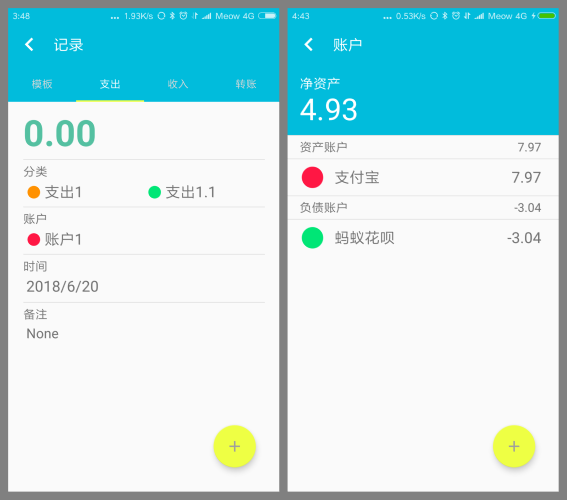
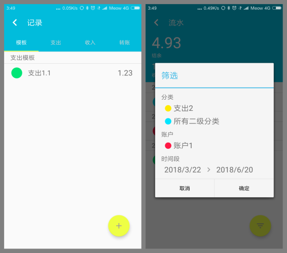

# 简介 / Introduction
Simpbook 是一款 Android 平台的记账软件，其具有以下特点。 
* 简洁轻量：Simpbook 是一款轻量级的记账软件，软件本体远小于同类型记账软件的体量。在设计方面，Simpbook 采用了基本的控件进行实现，并使用了Material Design 的设计思想，在简洁的同时兼顾了较好的使用体验。 
* 功能全面：Simpbook 实现了多项实用的记账功能，可以覆盖日常应用场景下多种形式的记账需求和数据使用需求。 
* 使用高效：Simpbook 参考了市面上存在多款记账软件，并结合开发者对过往产品的使用体验，对多个方面的逻辑和问题都进行了优化处理。 
* 隐私保护：Simpbook 无记账功能以外的权限需求，可以完全消除使用者对隐私方面的担忧。 

这个项目由nkucs1416小组在2018年春季完成。
***
Simpbook is an Android accounting app, with the following features. 
* Simplicity: Simpbook is a lightweight accounting app, its size is far less than other accounting apps. We use Material Design and basic components to build this app, which make this app has a great user experience. 
* Full-featured: Simpbook implements a number of useful accounting functions that cover multiple forms of accounting requirements in daily uses. 
* Efficiency: Simpbook refers to a variety of accounting apps in the market. We combine the experience of other products and improve the logics of the Simpbook in multiple areas. 
* Privacy: Simpbook does not have the permission requirements other than the accounting functions, which can completely eliminate the user's privacy concerns. 

The project was completed by the nkucs1416 team in the spring of 2018.   

# 链接 / Link
Google Play: https://play.google.com/store/apps/details?id=com.romickid.simpbook    

# 示例 / Demo
主页 / Home Page   流水页面 / Statement Page  

 记录页面 / Record Page   账户页面 / Account Page  

 模板页面 / Collection Page   筛选流水页面 / Statement Filter Page  

